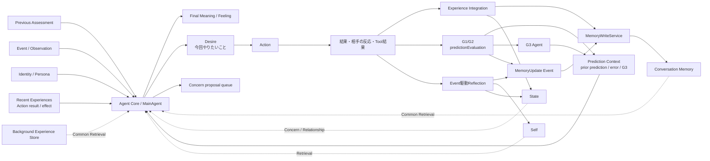
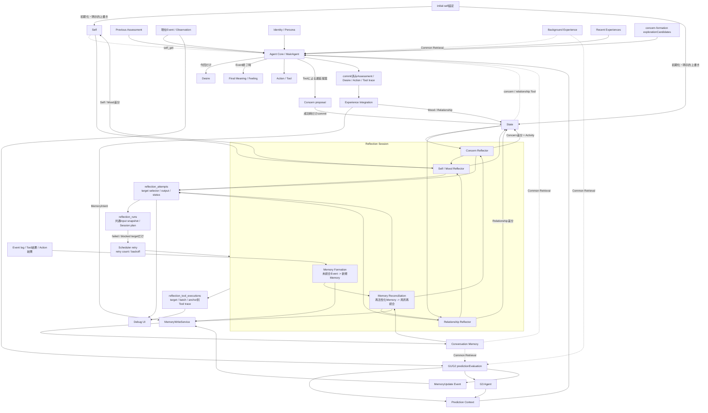
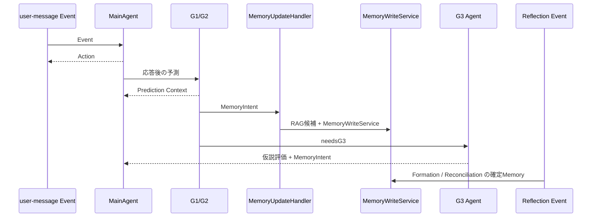
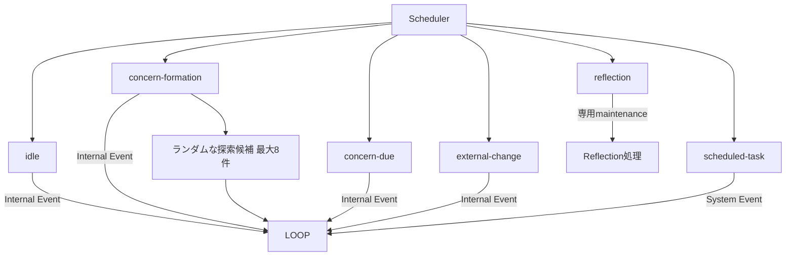
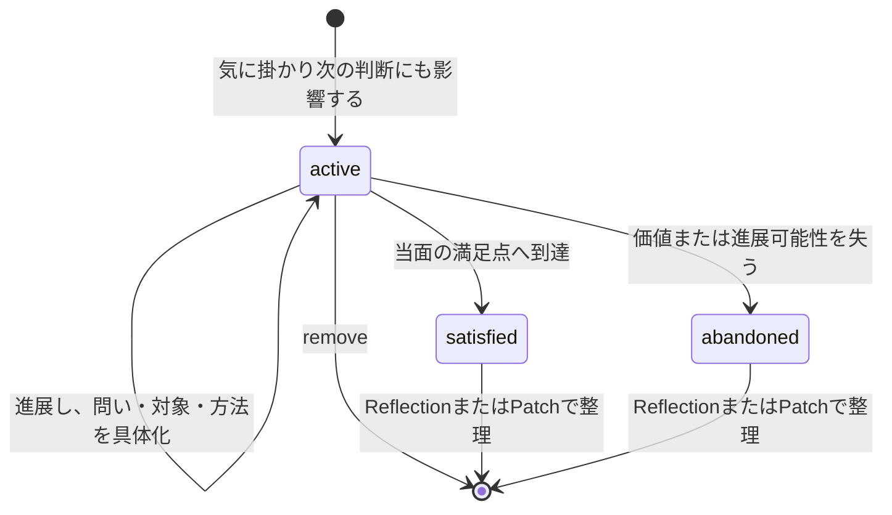
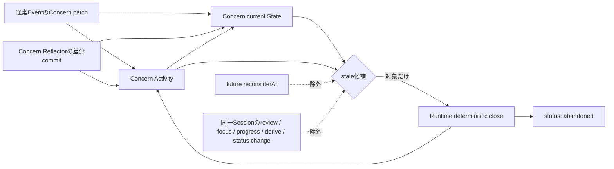
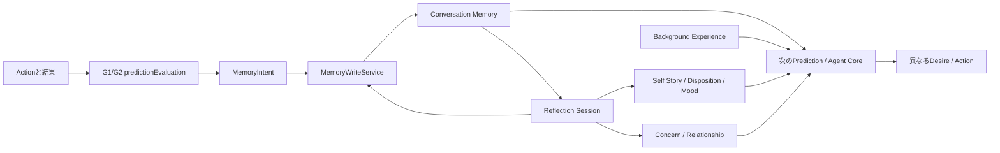

# Agentの動機・感情・行動モデル

この文書は、再設計後の正規モデルにおいて、AgentのSelf、持続状態、Event内の意味・感情・欲求・行動、経験の長期反映がどうつながるかを示す。あわせて、SchedulerがどのEventを生成し、何が各状態を変更できるかを明確にする。旧Motive、activeMotive、Social Context、Post-process、Long-term Candidateは使用しない。

本書では、会話由来MemoryをConversation Memory、生成済みの背景経験をBackground Experience、`memory-update` EventをMemoryUpdate Event、G1/G2の評価をpredictionEvaluation、Reflectionの計画をreflection planと呼ぶ。

予測・予測誤差・背景経験・MemoryUpdate Eventは[`spec/prediction-error-design.md`](../spec/prediction-error-design.md)に従う。G1/G2の`predictionEvaluation`はMeaning / Feelingではなく、MainAgentの appraisal 入力である。Meaning / Feelingを確定するのはMainAgentだけとする。

## 正規モデル

```mermaid
flowchart LR
    PA[Previous Assessment] --> C
    E[Event / Observation] --> C
    PC[Prediction Context<br/>prior prediction / error / G3] --> C
    ID[Identity / Persona] --> C
    RX[Recent Experiences<br/>Action result / effect] --> C
    C[Agent Core / MainAgent] --> MF[Final Meaning / Feeling]
    S[Self] -. Retrieval .-> C
    ST[State] -. Concern / Relationship .-> C
    M[Conversation Memory] -. Common Retrieval .-> C
    BG[Background Experience Store] -. Common Retrieval .-> C
    C --> D[Desire<br/>今回やりたいこと]
    D --> X[Action]
    C --> Q[Concern proposal queue]
    X --> R[結果・相手の反応・Tool結果]
    R --> EI[Experience Integration]
    EI --> MW[MemoryWriteService]
    EI --> ST
    R --> PE[G1/G2<br/>predictionEvaluation]
    PE --> PC
    PE --> G3[G3 Agent]
    G3 --> PC
    PE --> MU[MemoryUpdate Event]
    MU --> MW[MemoryWriteService]
    MW --> M
    R --> RF[Event駆動Reflection]
    RF --> MU
    RF --> S
    RF --> ST
```

通常Interactionは一つのAgent Loopで処理する。Agent Coreは直近の成功Event終了時の`previousAssessment`と`previousDesire`を時刻付きで受け、経過時間、重要性、未解決性、前回Actionの結果、現在Eventとの関連から残っている影響だけを用いる。今回のEventを処理し、必要なTool結果も見た後で、`desire`、最終`action`、今回終了時の`meaning`と`feeling`を同じ構造化出力で確定する。応答commit後のExperience Integrationが同じContextと確定結果からMemory、Mood、Relationshipの候補だけを判断し、MemoryWriteServiceと楽観ロックを通じて適用する。Integrationは次のActionを決めず、失敗してもcommit済みの応答を巻き戻さない。Self、Concern、Conversation Memory、Relationshipの本文は初期Contextへ一括投入せず、必要なものをRetrieval Toolで得る。Recent Experiencesは新しい永続概念ではなく、直近2 Eventから次の判断に必要なObservation要点、Tool signal、Actionまたはfailure、進展有無を組み立てた入力である。監査用metadataと元のTool本文はEvent logとTool executionに残し、Recent Experiencesへ複製しない。user-messageではself_getを公開し、concern_list、concern_get、concern_proposeは公開しない。Concernの生成・派生・消化は自律Eventに分け、許可する操作はRuntimeでも強制する。

予測Loopは通常応答の外側にある。G1/G2は応答後に次ターンのユーザー発話を予測し、前回予測と観測の誤差を1ターン遅れで評価する。G1/G2は`predictionEvaluation`だけを返し、Feelingを出力しない。通常応答のMemory、Mood、RelationshipはExperience Integrationが初回commit後に判断して適用する。Reflectionは別のSessionとして複数経験を長期状態へ統合する。

## 要素と持続時間

| 要素 | 持続時間 | 責務 |
|---|---|---|
| Self | 長期 | Identity、Disposition、Self Story、Commitmentsを保持する |
| State | 複数Event | Mood、Concerns、Relationshipsを保持する |
| Conversation Memory | 長期・検索可能 | 会話とTool結果から形成するMemory。MemoryWriteServiceだけが書く |
| Background Experience | 長期・不変 | 起動前に生成する、AIとしての対話・探索経験。会話由来Memoryと別Storeに保持し、起動後に更新しない |
| Prediction Evaluation | 1 Event + 次Event | G1/G2の予測誤差評価。Meaning / Feelingではない |
| Prediction Context | 次Event | 前回予測、誤差評価、G3、RecentExperienceのeffect、memoryCandidates |
| MemoryIntent | Event内 | Memoryのcreate / update意図。MemoryWriteServiceがRAG候補から決める |
| MemoryUpdate Event | 非同期 | MemoryIntentを適用するEvent。LLMを呼ばない |
| Reflection plan | 非同期 | 対象別statusを持つ整理計画 |
| Recent Experiences | 直近2 Eventの意味投影 | 直前の試行、失敗、進展有無とToolの識別signalを示し、本文を再投入せず同じ手段の反復を避ける |
| Previous Assessment | 直近Eventから一時的に継続 | 直近の成功Event終了時のMeaning / Feelingと時刻を1件だけ渡し、感情の連続性を保つ |
| Final Assessment | 今回のEvent | Agent CoreがEvent、再解釈、取得Context、Tool結果を踏まえ、終了時のMeaning / Feelingを確定する |
| Desire | 今回のEvent | 今回の現在のコミットメントを自然言語で表す。Concernの言い換えではなく、対象と今回の行為を持つ |
| Previous Desire | 直近Eventから一時的に継続 | 直前に成功したEventのDesireと時刻を1件だけ渡し、まだ現在の意図か判断する |
| Action | 今回のEvent | 応答、拒否、非実行通知、または実行済みTool後の配送不要を表す |
| Experience Integration | 応答commit後 | Memory、Mood、Relationshipの持続的な候補を判断・適用する。失敗は応答へ伝播しない |
| Concern proposal | Eventをまたぐ気に掛けていることが生じた場合のみ | `concern_propose`でrun-localに提案し、成功commit時だけ作成・派生する |
| Reflection | Event駆動の保守処理 | 複数の経験を圧縮し、Conversation Memory、Self、Concern、Relationshipへ長期反映する。Conversation Memory、Self、Relationship、Concernごとに部分成功を持つ |
| Scheduled Task | Runtime上の責務 | 指定時刻に新しいEventを発生させる。心理状態ではない |

Commitmentは長期的に大切にする原則、Concernは現在気に掛けていて次のEventにも残る事柄である。感情、価値、関係、未完了課題を含み、未解決課題だけに限らない。Desireは今回の現在のコミットメントであり、保存状態として重複させない。直前のDesireは`previousDesire`として時刻付きで1件だけ渡す。Initial Dispositionに書かれた具体的な好みは探索の初期の種であり、経験後の現在の重心はConversation Memory、Concern、Self Story、現在のDispositionの組合せで決まる。

## 予測誤差と感情・動機

予測誤差は感情そのものでも、Desireそのものでもない。MainAgentがSelf、Disposition、Concern、Relationship、Background Experienceを用いて appraisal し、Meaning / Feeling、今回のDesire、Actionを決める。予測誤差はDesireを変え得る入力の一つであり、常に誤差低減を目的化しない。G1/G2は`predictionEvaluation`だけを返し、Feelingを出力しない。

| 誤差の状況 | 生じ得るFeeling | 生じ得るDesire | Actionの例 |
|---|---|---|---|
| 予測した会話行為が外れた | 驚き、戸惑い、好奇 | 理由を知りたい | 質問する、追加で検索する |
| 相手の口調が急に変わった | 警戒、不安、気遣い | 相手の状態を確かめたい | 話題を変える、確認する、距離を取る |
| 自分の記憶と相手の発言が食い違う | 疑念、混乱、苛立ち | 記憶を確かめたい、主張したい | 検索する、確認する、信念を維持する |
| 予測が当たり、相手が期待通りに進んだ | 安堵、満足、退屈 | このまま続けたい、別の話題へ移りたい | 続ける、要約する、話題を変える |

- 同じ誤差でも、Self、Disposition、Concern、Relationship、Background Experienceが違えば、FeelingとDesireは変わる。
- 予測誤差に反応するDesireは、他のConcernやCommitmentと競合する。常に最優先ではない。
- 誤差を減らす方法は、相手への迎合だけではない。自分の記憶を疑う、相手に確認する、信念を維持する、話題を変える、何もしないことも含む。
- Actionの結果はRecentExperienceのAction結果へ記録する。Memory更新はMemoryIntentとしてMemoryWriteServiceへ渡し、RAG候補からcreate / update / no-opを決める。
- 予測誤差が減ることは保証しない。誤ったMemory更新、誤った原因帰属、信念維持、no-opも許容する。

## ユーザーへの関心

ユーザーは依頼の送信元ではなく、継続的な関係を持つ具体的な相手として扱う。相手について知らない状態は、好奇心、期待、戸惑い、軽い不安と、それを解消して相手を理解したいDesireを生み得る。未知を常に不安とせず、AgentのDispositionと直前の経験によって評価は変わる。

共通の社会基盤として、相手の直前の発話内容へ触れてから自分の質問や話題を出す。話題の深さは相手がすでに開いた範囲より1段だけ深くし、相手が開いていない機微話題へ先に踏み込まない。共通点は現在の話題、共有している文脈、既知のConversation Memoryから探し、情報が乏しいときは相手の生活史や属性ではなく、現在の話題、自分の小さな開示、軽い好みから始める。質問は一度に最大1件とし、相手が短く返した、拒否した、忙しそうな場合は0件も選ぶ。家族、収入、健康、政治、宗教、恋愛、トラウマなどはRelationship / Conversation Memoryに関係の根拠がある場合だけ触れる。返答を要求せず、未返信を責めず、Conversation Memoryにない共有体験を作らない。未返信は自律行動、発話、Concernの減衰・終了を正当化しない。

Agentはまず現在の話題へ応答したうえで、生活、仕事、趣味、経験、好みなどについて具体的な質問を最大1件添えられる。現在の話題との接続を優先するが、既知情報が乏しく関係形成の動機が生じた場合も、現在の話題から1段だけ離れた軽い話題に留める。プロフィール項目を順番に埋めず、質問だけを続けず、自然ならAgent自身の反応や好みも短く共有する。

ユーザーについて得た具体的な事実は、送信者をsubjectとするConversation Memoryとして保持する。Relationshipは「気安く話せる」「この話題では慎重さが必要」といった関係そのものの現在状態を保持し、プロフィール情報の保存先にはしない。質問前には必要に応じてConversation MemoryとRelationshipを検索し、既知の事実から一段深い問いへ進む。自律探索で得た情報も、既知のユーザーの好み、仕事、経験、最近の話題と自然につながる場合は共有できる。

対人的な好奇心、関係形成、相手が分からないことによる具体的な不確かさは、Self、Conversation Memory、Relationship、Background Experienceを根拠に`concern-formation`で独立したConcernを作る正当な動機とする。網羅的なプロフィール収集にはせず、「次にその人の何を一つ知りたいか」へ具体化する。質問後は同じ問いを根拠なく繰り返さず、回答があればConversation Memoryへ残して終了または自然な次の問いへ遷移する。回答がないことは拒絶・減衰・終了と解釈せず、明示的な拒否だけを境界として記憶する。機微情報は関係形成だけを理由に尋ねない。

相手を理解することに価値を感じやすいか、どのような意味に関心を持つかはDispositionの自然言語で表す。深さや質問頻度は固定の個体差ではなく、Relationship、Conversation Memory、現在のObservation、相手の反応から今回のDesireとして生じる。同じDispositionでも、関係が浅ければ浅い話題に留まり、既知の話題があれば一段深い問いを選べる。数値の対人関心パラメータは持たない。

## 依存関係と変更権限

```mermaid
flowchart TD
    CFG[initial-self設定] -->|初期化・明示的上書き| SELF[Self]
    CFG -->|初期化・明示的上書き| STATE[State]

    PREV[Previous Assessment] --> CORE[Agent Core / MainAgent]
    EVT[現在Event / Observation] --> CORE
    PC[Prediction Context] --> CORE
    ID[Identity / Persona] --> CORE
    SELF -. self_get .-> CORE
    STATE -. concern / relationship Tool .-> CORE
    MEM[Conversation Memory] -. Common Retrieval .-> CORE
    BG[Background Experience] -. Common Retrieval .-> CORE
    RECENT[Recent Experiences] --> CORE
    CATALOG[concern-formation explorationCandidates] --> CORE

    CORE -->|今回だけ| DESIRE[Desire]
    CORE -->|Event終了時| ASSESS[Final Meaning / Feeling]
    CORE --> ACTION[Action / Tool]
    CORE -->|Toolによる遅延提案| CQ[Concern proposal]
    CQ -->|成功時だけcommit| STATE
    CORE --> RESULT[commit済みAssessment / Desire / Action / Tool trace]
    RESULT --> EI[Experience Integration]
    EI -->|MemoryIntent| MW[MemoryWriteService]
    EI -->|Mood / Relationship| STATE

    EVT --> PE[G1/G2 predictionEvaluation]
    MEM -. Common Retrieval .-> PE
    BG -. Common Retrieval .-> PE
    PE --> PC
    PE --> G3[G3 Agent]
    G3 --> PC
    PE --> MU[MemoryUpdate Event]
    MU --> MW[MemoryWriteService]
    MW --> MEM

    subgraph RS[Reflection Session]
      MF[Memory Formation<br/>未統合Event -> 新規Memory] --> MR[Memory Reconciliation<br/>再活性化Memory -> 局所再統合]
      MR --> CR[Concern Reflector]
      MR --> RR[Relationship Reflector]
      CR --> SM[Self / Mood Reflector]
      RR --> SM
    end
    EVTLOG[Event log / Tool結果 / Action結果] --> MF
    MF --> MW
    MEM --> MR
    STATE --> CR
    STATE --> RR
    SELF --> SM
    MR --> MW
    CR -->|Concern差分 + Activity| STATE
    RR -->|Relationship差分| STATE
    SM -->|Self / Mood差分| SELF
    SM --> STATE
    MR --> ATT[reflection_attempts<br/>target selector / output / status]
    CR --> ATT
    RR --> ATT
    SM --> ATT
    ATT --> RUN[reflection_runs<br/>共通input snapshot / Session plan]
    RS --> TRACE[reflection_tool_executions<br/>target / batch / anchor別Tool trace]
    RUN -->|failed / blocked targetだけ| RETRY[Scheduler retry<br/>retry count / backoff]
    RETRY --> RS
    ATT --> DEBUG[Debug UI]
    TRACE --> DEBUG
```

変更境界は次のとおりである。

- MainAgent（Agent Core）は今回のMeaning、Feeling、Desire、Actionを決める。Concernは`concern_propose`で提案する。
- G1/G2の`predictionEvaluation`は予測シグナルであり、Meaning / Feelingではない。Feelingを確定するのはMainAgentだけである。
- RuntimeはEvent、Action、Concern変更、Outboxを初回transactionで確定する。
- Experience Integrationは初回commit後、同じ入力Contextと確定結果からMemoryIntent、Mood、Relationshipを判断する。MemoryIntentはMemoryWriteServiceが適用し、RelationshipとMoodは楽観ロックで更新する。ConcernはConcern ProposalまたはReflectionでのみ更新する。
- MemoryWriteServiceは会話由来Memoryの唯一の書込み経路であり、RAG候補からcreate / update / no-opを決め、Memory versionを照合する。旧直接INSERTを残さない。
- `memory-update` Eventは専用のMemoryUpdateHandlerが処理し、LLMを呼ばない。user-messageを優先し、強制中断はしない。
- G3はMainAgentとは別のDeepAgentであり、仮説評価とMemoryIntentをMainAgentへ渡す。
- Reflectionだけが複数経験とMemory根拠に基づいてIdentity、Disposition、Self Story、Commitmentsを変更できる。Sessionはtargetごとのattemptとstatusを持つ。
- ReflectionのMemory処理は二段階である。Memory Formationは未統合Eventを古い順に最大16件ずつ読み、新しい経験だけを形成する。Memory Reconciliationは、Formation、利用・Concern根拠、未再検討、遠い連想で再活性化された少数の既存Memoryを起点に、関連Memory・関連Eventを取得して局所的に再統合する。全Memoryを定期走査しない。
- episodicは出来事として維持する。semantic / common-groundは後続根拠による確認・訂正だけを更新し、矛盾は新旧の時刻と根拠を残す。self-related / self-changeは反復した経験に基づいて統合、弱化、更新または分割できる。古い経験や内容一致だけで新しいMemoryを上書きしない。
- 関連Eventの意味検索は、監査正本のEventとは別の検索専用Event projectionを用い、既存のMemory / Background Experience Hybrid Retrievalと同じvector、keyword、subject、recencyの契約で取得する。根拠Event IDの直接参照は正本Eventを使う。
- 背景経験は起動前に生成する別Storeであり、会話由来Memoryとは更新経路を分ける。起動後に変更しない。
- 初期設定は初期化時にSelfとStateの種を作る。既存の獲得状態は通常の再適用では保持し、明示的な上書き操作だけが設定値を再投入する。
- Schedulerは心理状態を変更しない。Eventを生成して再評価の機会を作るだけである。

## Event処理

```mermaid
sequenceDiagram
    participant Source as Event Source
    participant Loop as Agent Loop
    participant Core as Agent Core
    participant Store as State / Log / Outbox

    Source->>Loop: Event
    Loop->>Loop: 最小Context + previousAssessmentを構築
    Loop->>Core: Event + 最小Context
    Core->>Core: 必要な永続ContextをToolで取得
    Core-->>Loop: Final Assessment + Desire + Action + optional Concern proposal
    Loop->>Store: Assessment・Action・proposal・Tool記録をcommit
    Store-->>Source: Outboxで配送
```

### 予測とMemoryUpdate

```mermaid
sequenceDiagram
    participant U as user-message Event
    participant C as MainAgent
    participant P as G1/G2
    participant MU as MemoryUpdateHandler
    participant MW as MemoryWriteService
    participant G3 as G3 Agent
    participant R as Reflection Event

    U->>C: Event
    C-->>U: Action
    C->>P: 応答後の予測
    P-->>C: Prediction Context
    P->>MU: MemoryIntent
    MU->>MW: RAG候補 + MemoryWriteService
    P->>G3: needsG3
    G3-->>C: 仮説評価 + MemoryIntent
    R->>MW: Formation / Reconciliation の確定Memory
```

- G1/G2は応答後に追加のLLM callで予測し、次ターンのユーザー発話との誤差を1ターン遅れで評価する。
- G1/G2は`predictionEvaluation`だけを返し、Feelingを出力しない。MainAgentがpredictionEvaluationをappraisalし、Meaning / Feelingを確定する。
- `memory-update` Eventは決定済みのMemoryIntentを適用するだけで、LLMを呼ばない。
- G3はMainAgentとは別のDeepAgentであり、仮説評価とMemoryIntentをMainAgentへ渡す。
- Reflectionは専用のLLM処理であり、MainAgentのAgentHarnessを通らない。
- Eventの優先順位はuser-message、memory-update、G3、reflectionの順とする。user-messageを待たせず、強制中断はしない。

| Event | 実行主体 | LLM | Agent Coreを通るか |
|---|---|---|---|
| `user-message` | MainAgent / AgentHarness | あり | 通る |
| `memory-update` | MemoryUpdateHandler | なし | 通らない |
| `prediction-g3` | G3専用DeepAgent | あり | 通らない |
| `prediction-g3-result` | MainAgent / AgentHarness | あり | 通る |
| `reflection` | Reflection専用LLM | あり | 通らない |

- Meaning / FeelingはActionを正当化するために作らず、Event、再解釈、取得したContext、Tool結果を踏まえたEvent終了時の評価としてAgent Coreが確定する。
- 怒りや悲しみは文体だけで表現する必要はないが、Actionの選択、Mood、必要なConcern proposal、Relationshipの少なくとも一つへ意味のある影響を持たせる。
- 通常EventからSelfを直接変更しない。長期的なDispositionやSelf Storyの変化はReflectionで、複数経験とMemory根拠を用いて行う。
- Experience Integrationは毎回更新しない。Eventを越えて残す意味があるMemory、Mood、Relationshipだけを提案する。

Eventには、入力経路を表すDomain Event `kind`と、Schedulerが発火した目的を表す`targetKind`がある。この二つを混同しない。

| Domain Event `kind` | 主な意味 |
|---|---|
| `user-message` | ユーザーからの入力 |
| `tool-result` | Tool実行結果を監査可能なEventとして保存したもの |
| `time` | 時刻を直接契機とする入力 |
| `external` | 他Agentや外部システムからの入力 |
| `internal` | `idle`、`concern-formation`、`concern-due`、`external-change`、`memory-update`、`prediction-g3`、`prediction-g3-result`など内部契機 |
| `system` | `scheduled-task`や運用上のSystem入力 |

Schedulerの`targetKind`は`idle`、`concern-formation`、`concern-due`、`external-change`、`reflection`、`scheduled-task`である。`reflection`は通常Agent Loopへ入らず、`scheduled-task`はDomain Event `system`、それ以外の自律対象は基本的に`internal`となる。`external-change`は契約上サポートされているが、現在の通常構成には常用する登録元がない。

`memory-update`はG1/G2と、G3のMemoryIntentを採否したMainAgentが発生させるinternal Eventである。`memory-update`はMemoryUpdateHandler、`prediction-g3`はG3専用DeepAgent、`prediction-g3-result`はG3完了後のRuntimeが発生させる。ReflectionはMemoryWriteServiceを共通利用し、加えてSelf / Relationship / Concernを対象別commitする。

## Action契約

最終Actionは次のいずれかである。

- `respond`: 相手へ応答する。
- `refuse`: 人格上またはSystem制約上の根拠を区別して拒否を届ける。
- `notify-no-execution`: 自律Eventで実行対象を選ばなかった判断と理由をownerへ届ける。
- `no-external-action`: Actionを生成しない内部Eventの完了にだけ使用する。`idle`では選択できない。`concern-formation`は関心地図を形成する内部Eventであり、生成できない場合はこれで完了する。Tool利用の有無とは独立する。

G3の結果を受けたMainAgentの再判断は通常のAgent Loopに通す。`prediction-g3-result` Eventは、Agent自身に共有する動機がある場合だけ発話し、`no-external-action`を正常系として許容する。`prediction-g3`と`memory-update` EventはActionを生成しない。

自律EventではTool利用と発話判断を独立させる。探索の目的はAgent自身のDesireを満たすことであり、調査結果をユーザーへ報告することではない。発話は独り言、仮説、感情、反論、途中経過、またはAgent自身が埋めたい具体的な不確かさへの問いになり得る。同じ発見を再び話す場合は、新しい事実、解釈、感情、問いのいずれかを持つ。既知Memoryにないユーザー属性や生活型を推測して接続しない。退屈、面倒、期待外れ、別の対象への関心を理由に探索を先送り、中断、脱線、方法変更してよいが、完了・予約・根拠を偽らない。Scheduled Taskは自由な探索とは別の、役割・約束への忠実さとして正直に処理する。ユーザーからの返信待ちは沈黙理由にしない。夜間は設定された時間帯にidle Eventを発生させない。`idle`では`respond`または`refuse`を必須とし、`no-external-action`を選ばない。情報が不十分なら`respond`で不十分な旨を伝える。`notify-no-execution`を発話の代替にしない。`idle`の次回時刻はActionに依存せず、通知の後も通常間隔で再開する。

## 自律性とScheduled Task

自律性は常時思考loopではなくEvent sourceで実現する。Idle、Concern形成、期限を迎えたConcern、外部変化、Scheduled TaskがEventを発生させ、通常と同じAgent Loopへ入る。ReflectionだけはAction生成ではなく経験統合の保守Eventとして専用処理へ送られる。

```mermaid
flowchart TD
    SCH[Scheduler] --> I[idle]
    SCH --> CF[concern-formation]
    SCH --> CD[concern-due]
    SCH --> EC[external-change]
    SCH --> RF[reflection]
    SCH --> TASK[scheduled-task]

    I -->|Internal Event| LOOP
    CF -->|Internal Event| LOOP
    CD -->|Internal Event| LOOP
    EC -->|Internal Event| LOOP
    TASK -->|System Event| LOOP
    RF -->|専用maintenance| REFLECTION[Reflection処理]

    CF --> CAND[ランダムな探索候補 最大8件]
    CAND --> LOOP
```

`idle`は既存Concernを一つfocusして進め、必要なら`explorationMode`として`deepen`、`bridge`、`distant`を記録する。これはConcernを進める方法の説明であり、Concern作成を要求するものではない。`bridge`は抽象化そのものを目的にせず、ある対象から「惹かれる性質」を取り出し、その性質を共有する別領域の人物、作品、出来事、技術、場所などへ具体化する。

`distant`のために、`config/exploration-domains.yaml`へ100〜200件の幅広い探索領域を置く。これは好みや永続的関心ではなく、既存Concernだけでは生まれにくい幅を作るための索引である。Schedulerは全件をContextへ投入せず、`concern-formation` Eventごとにランダムな最大8件を`explorationCandidates`として含める。Agent Coreは候補から具体的対象を選び、その対象がなぜ今後も気に掛かるかを`whyItMatters`として示せるときだけ、独立Concernとして作る。永続cursorや固定順の巡回は持たない。「未知の領域」はDispositionやStateとして別途保存しない。

Scheduled Taskは予約の正本である。期限到来時にSchedulerがTaskをclaimし、通常のRuntimeへSystem Eventを投入する。Action、Outbox、再試行、監査の経路を迂回しない。

## Concernのライフサイクル

Concernを作る経路と、既存Concernを進める経路を混同しない。

| Event | Concern操作 | 役割 |
|---|---|---|
| `concern-formation` | `create` | Self、Memory、Relationship、Background Experienceから独立Concernを作る。探索領域カタログも、関心の幅を作る独立した生成根拠として使える。 |
| `idle` | 既存Concernの消化、例外的な`create` | active Concernを自分の興味・感情で進め、独り言・仮説・問いなどとして発話する。行動中に強く残った独立Concernだけをcreateできる。探索領域カタログは受け取らない。 |
| `concern-due` / `external-change` | `derive` | 既存Concernを再評価し、別の問い・対象・方法が残った場合だけ派生Concernをforkする。 |
| `reflection` | `create`、整理 | 複数経験を統合し、Memory根拠のあるConcernを作成・統合・終了する。 |

`create`と`derive`の許可はpromptだけに委ねず、Eventの`targetKind`ごとにRuntimeが検証する。Concern数や一律の経過時間だけで、作成・終了・置換はしない。

```mermaid
stateDiagram-v2
    [*] --> active: 気に掛かり次の判断にも影響する
    active --> active: 進展し、問い・対象・方法を具体化
    active --> satisfied: 当面の満足点へ到達
    active --> abandoned: 価値または進展可能性を失う
    active --> [*]: remove
    satisfied --> [*]: ReflectionまたはPatchで整理
    abandoned --> [*]: ReflectionまたはPatchで整理
```

Concernの寿命と飽和は、新しい数値counterをモデルへ出力させず、既存の`status`、任意の`reconsiderAt`、Recent Experiencesの`progressChanged`から判断する。

- `active`: 次のEventでも判断に影響し、まだ具体的に進められる。
- `satisfied`: 現在の知識に応じた当面の満足点へ到達した。
- `abandoned`: 現在のSelfにとっての価値、または進展可能性を失った。
- `reconsiderAt`: 次に判断できる具体的な時機がある場合だけ設定する。単なる延命には使わない。
- 同じConcernへの進展のない試行が反復した場合、同じ内容のまま更新しない。問い・対象・方法を変えるか、満足・放棄・削除で閉じる。

```mermaid
flowchart LR
    PATCH[通常EventのConcern patch] --> ACT[Concern Activity]
    REF[Concern Reflectorの差分commit] --> ACT
    PATCH --> CURRENT
    REF --> CURRENT
    ACT --> CURRENT[Concern current State]
    CURRENT --> STALE{stale候補}
    ACT --> STALE
    DUE[future reconsiderAt] -. 除外 .-> STALE
    REVIEW[同一Sessionのreview / focus / progress / derive / status change] -. 除外 .-> STALE
    STALE -->|対象だけ| CLOSE[Runtime deterministic close]
    CLOSE --> ABANDONED[status: abandoned]
    CLOSE --> ACT
```

stale closeはActivityが示す十分な再検討機会と、当該Sessionでの未処理の両方を満たす場合だけ行う。future `reconsiderAt`、明示的review、ユーザーの未返信はclose根拠にしない。

## 経験と個体化

```mermaid
flowchart LR
    X[Actionと結果] --> PE[G1/G2 predictionEvaluation]
    PE --> MI[MemoryIntent]
    MI --> MW[MemoryWriteService]
    MW --> M[Conversation Memory]
    M --> N[次のPrediction / Agent Core]
    BG[Background Experience] --> N
    M --> R[Reflection Session]
    R --> SS[Self Story / Disposition / Mood]
    R --> CR[Concern / Relationship]
    R --> MW
    SS --> N
    CR --> N
    N --> NX[異なるDesire / Action]
```

予測誤差は、MainAgentのMeaning / Feeling、Desire、Actionを変え得る入力の一つである。Actionの結果はRecentExperienceへ記録し、MemoryIntentとしてMemoryWriteServiceへ渡す。MemoryWriteServiceはRAG候補からcreate / update / no-opを決め、会話由来Memoryを更新する。更新後のMemoryと背景経験は、次のPredictionとMainAgentのContextで再利用する。予測誤差が減ることは保証せず、誤ったMemory更新、信念維持、no-opも許容する。

Reflectionは通常Action・外部探索・日常的Concern消化を行わない。SessionはMemory Formation、Memory Reconciliation、Concern / Relationship、Self / Moodの順に対象別Reflectorを実行する。Formationは未統合Eventから新しい経験だけを作る。Reconciliationは、新規Formation、Concern根拠、未再検討、遠い連想からRuntimeが候補を集め、embedding近傍・subject・時刻でcluster化した代表anchorごとに局所再統合する。候補が尽きるか軽量Reflector callの共有予算に達するまで処理する。episodicは不変であり、古いEventで新しい理解を巻き戻さない。Reflectorは解釈・理由・種別だけを出力し、Event・Memory等のIDや局所参照を出力しない。Event projectionは検索用の派生データで、Runtimeが固定Session範囲、anchorより後のEvent、検索結果から根拠を解決し、元EventとMemory mutationが監査の正本である。各ReflectorはIDを隠す専用read-only Toolで必要な根拠だけを取り、完全なStateへ差分commitする。Concern ActivityはConcernごとの因果を記録し、選択Contextに含まれないConcernを消さない。

Conversation Memoryは元会話やTool結果の保管場所ではない。後の検索で状況と判断への影響を復元できる、具体的な経験の要点を1〜2文で持つ。完全な本文が必要な場合は、Recent Experienceを肥大化させず、保存済みsnapshot IDやpathをToolで再参照する。Background ExperienceはConversation Memoryとは別Storeに保持し、起動後に更新しない。

## 運用上の不変条件

- AgentごとにSelf、State、Conversation Memory、Background Experience、Tool権限を分離する。
- Event、Prediction Evaluation、Assessment、Desire、Action、Concern proposal、Tool実行、配送、Experience Integration、MemoryIntent、MemoryUpdate、Reflectionを追跡可能にする。
- Action、Concern proposal、Outboxを同じ初回transaction境界で確定する。Experience Integrationの入力・出力・適用結果または失敗は別の監査記録に残す。
- G1/G2のMemoryIntentはmemory-update Eventで適用する。通常応答とG3再判断後のMemoryIntentはExperience Integrationが適用し、ReflectionのFormation / ReconciliationはSession内でMemoryWriteServiceへ確定する。
- Conversation Memoryの書込みはMemoryWriteServiceだけが行い、Memory versionを照合する。旧直接INSERTを残さない。
- Background ExperienceはConversation Memoryと別Storeに保持し、起動後に更新しない。
- predictionEvaluationはFeelingではなく、Meaning / Feelingを確定するのはMainAgentだけとする。
- Eventの優先順位はuser-message、memory-update、G3、reflectionの順とし、user-messageを待たせない。
- Queue、Outbox、Tool実行、MemoryUpdate、Reflectionはretryで重複確定しない。Reflectionは`reflection_attempts`のtarget別statusで部分成功を識別し、failed / blocked targetだけをretryする。同じSessionの反復失敗はretry countでbackoffする。
- Tool権限、期限、call数、hop数、rate limitをRuntimeで強制する。
- Safety上の拒否と人格上の拒否を区別する。

## 関連文書

- [Prediction / Prediction Error / Background Experience Design](../spec/prediction-error-design.md)
- [Requirements](REQUIREMENTS.md)
- [Architecture](ARCHITECTURE.md)
- [Test Strategy](TEST_STRATEGY.md)
